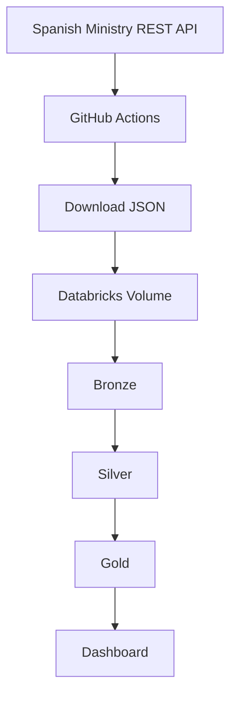

# ⛽ Spain Fuel Prices Automated Lakehouse Pipeline

> Automated Lakehouse Pipeline for fuel prices in Spain using GitHub Actions, Databricks Workflows, PySpark and Medallion Architecture.

---

## 📑 Table of Contents

- [Project Overview](#1-project-overview)
- [Architecture](#2-architecture)
- [Technologies](#3-technologies)
- [Project Structure](#4-project-structure)
- [Data Source](#5-data-source)
- [Pipeline Workflow](#6-pipeline-workflow)
- [Medallion Architecture](#7-medallion-architecture)
- [Bronze Layer](#8-bronze-layer)
- [Silver Layer](#9-silver-layer)
- [Gold Layer](#10-gold-layer)
- [Automation](#11-automation)
- [Dashboard](#12-dashboard)
- [KPIs](#13-kpis)
- [How to Run](#14-how-to-run)
- [Project Results](#15-project-results)
- [Future Improvements](#16-future-improvements)
- [Lessons Learned](#17-lessons-learned)

---

# 1. Project Overview

This project implements an automated Lakehouse pipeline for fuel prices in Spain using the Medallion Architecture (Bronze, Silver and Gold) on Databricks.

The pipeline automatically downloads the latest fuel price dataset from the official Spanish Ministry REST API, uploads the raw JSON file to a Databricks Volume, processes the data through multiple transformation layers using PySpark, and generates analytical datasets that support business intelligence dashboards and price analysis.

The entire workflow is automated using GitHub Actions and Databricks Workflows. A self-hosted GitHub Actions Runner triggers the pipeline, allowing a complete end-to-end execution with a single click.

The project processes more than **11,000 fuel stations** across Spain and produces analytical datasets such as national rankings, provincial rankings, average fuel prices, historical price changes and competitive price analysis.

This project demonstrates practical skills in Data Engineering, including ETL development, data modeling, workflow orchestration, Delta Lake, PySpark transformations, SQL analytics and automated cloud pipelines.

---

# 2. Architecture

> _(Coming in the next section.)_

---

# 3. Technologies

> _(Coming in the next section.)_

---

# 4. Project Structure

> _(Coming in the next section.)_

---

# 5. Data Source

> _(Coming in the next section.)_

---

# 6. Pipeline Workflow

> _(Coming in the next section.)_

---

# 7. Medallion Architecture

> _(Coming in the next section.)_

---

# 8. Bronze Layer

> _(Coming in the next section.)_

---

# 9. Silver Layer

> _(Coming in the next section.)_

---

# 10. Gold Layer

> _(Coming in the next section.)_

---

# 11. Automation

> _(Coming in the next section.)_

---

# 12. Dashboard

> _(Coming in the next section.)_

---

# 13. KPIs

> _(Coming in the next section.)_

---

# 14. How to Run

> _(Coming in the next section.)_

---

# 15. Project Results

> _(Coming in the next section.)_

---

# 16. Future Improvements

> _(Coming in the next section.)_

---

# 17. Lessons Learned

> _(Coming in the next section.)_

