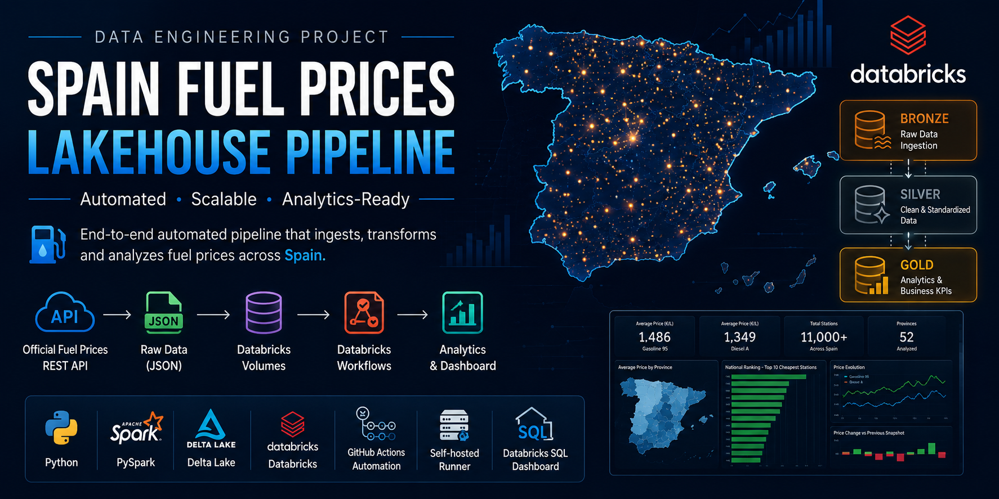
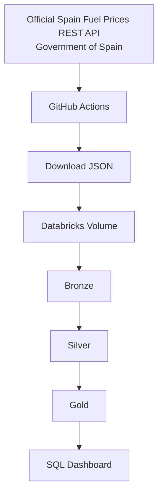
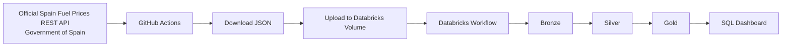
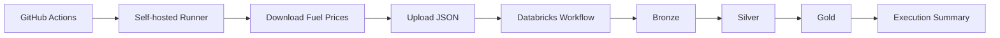

<p align="center">
  
</p>

<p align="center">
  
  
  
  
  
  
</p>

# ⛽ Spain Fuel Prices Automated Lakehouse Pipeline

> Automated Lakehouse Pipeline for fuel prices in Spain using GitHub Actions, Databricks Workflows, PySpark and Medallion Architecture.

---

## 📑 Table of Contents

- [Project Overview](#1-project-overview)
- [Architecture](#2-architecture)
- [Technologies](#3-technologies)
- [Project Structure](#4-project-structure)
- [Data Source](#5-data-source)
- [Pipeline Workflow](#6-pipeline-workflow)
- [Medallion Architecture](#7-medallion-architecture)
- [Bronze Layer](#8-bronze-layer)
- [Silver Layer](#9-silver-layer)
- [Gold Layer](#10-gold-layer)
- [Automation](#11-automation)
- [Dashboard](#12-dashboard)
- [KPIs](#13-kpis)
- [How to Run](#14-how-to-run)
- [Project Results](#15-project-results)
- [Future Improvements](#16-future-improvements)
- [Lessons Learned](#17-lessons-learned)

---

# 1. Project Overview

This project implements an automated Lakehouse pipeline for fuel prices in Spain using the Medallion Architecture (Bronze, Silver and Gold) on Databricks.

The pipeline automatically downloads the latest fuel price dataset from the official Spanish Ministry REST API, uploads the raw JSON file to a Databricks Volume, processes the data through multiple transformation layers using PySpark, and generates analytical datasets that support business intelligence dashboards and price analysis.

The entire workflow is automated using GitHub Actions and Databricks Workflows. A self-hosted GitHub Actions Runner triggers the pipeline, allowing a complete end-to-end execution with a single click.

The project processes more than **11,000 fuel stations** across Spain and produces analytical datasets such as national rankings, provincial rankings, average fuel prices, historical price changes and competitive price analysis.

This project demonstrates practical skills in Data Engineering, including ETL development, data modeling, workflow orchestration, Delta Lake, PySpark transformations, SQL analytics and automated cloud pipelines.

---

# 2. Architecture



---

# 3. Technologies

## 3. Technologies

| Technology           | Purpose                                                                              |
| -------------------- | ------------------------------------------------------------------------------------ |
| Python               | Downloads the fuel prices dataset and orchestrates automation scripts.               |
| PySpark              | Performs distributed data transformations across the Bronze, Silver and Gold layers. |
| Databricks           | Cloud platform used to build, execute and orchestrate the Lakehouse pipeline.        |
| Delta Lake           | Provides reliable storage with ACID transactions for all processed datasets.         |
| GitHub Actions       | Automates the end-to-end execution of the pipeline.                                  |
| Self-hosted Runner   | Executes GitHub Actions workflows on a dedicated local machine.                      |
| Databricks Workflows | Orchestrates the execution of Bronze, Silver and Gold notebooks.                     |
| Databricks Volumes   | Stores the raw JSON files ingested from the REST API.                                |
| Databricks SQL       | Supports analytical queries and dashboard visualization.                             |
| SQL                  | Used for analytical queries and KPI generation.                                      |
| REST API             | Retrieves the latest official fuel prices from the Government of Spain.              |
| Git & GitHub         | Version control and source code management.                                          |

---

# 4. Project Structure

```text

spain-fuel-prices-lakehouse-pipeline/

│

├── .github/

│   ├── workflows/

│   │   └── run_pipeline.yml

│   └── scripts/

│       └── generate_summary.py

│

├── data/

│   └── raw/

│

├── notebooks/

│   ├── 01_bronze.py

│   ├── 02_silver.py

│   └── 03_gold.py

│

├── scripts/

│   ├── download_fuel_prices.py

│   └── upload_to_databricks.py

│

├── requirements.txt

├── .gitignore

└── README.md

```

### Directory Description

| Directory | Description |

|-----------|-------------|

| `.github/workflows` | GitHub Actions workflow that automates the complete pipeline execution. |

| `.github/scripts` | Helper scripts used by GitHub Actions. |

| `data/raw` | Temporary storage for downloaded JSON files before uploading them to Databricks. |

| `notebooks` | Databricks notebooks implementing the Bronze, Silver and Gold layers. |

| `scripts` | Python scripts responsible for downloading the dataset and uploading it to Databricks Volumes. |

| `README.md` | Project documentation. |

| `requirements.txt` | Python dependencies required to run the project locally. |

| `.gitignore` | Files and directories excluded from version control. |

---

# 5. Data Source

The pipeline uses the **Official Spain Fuel Prices REST API (Government of Spain)** as its primary data source.

The API provides updated fuel prices for service stations across Spain, including station identification, operator, address, geographic coordinates and prices for different fuel types.

### Data Source

- **Source:** Official Spain Fuel Prices REST API
- **Provider:** Government of Spain
- **Format:** JSON
- **Update Frequency:** Approximately every 30 minutes
- **Data Coverage:** More than 11,000 fuel stations across Spain

The dataset is downloaded automatically by GitHub Actions and uploaded to a Databricks Volume before being processed through the Medallion Architecture.

---

# 6. Pipeline Workflow

The pipeline executes automatically from data ingestion to analytical dataset generation.



### Pipeline Steps

1. Download the latest fuel prices dataset from the official REST API.
2. Store the JSON file locally.
3. Upload the dataset to a Databricks Volume.
4. Execute the Databricks Workflow.
5. Transform the raw data into the Bronze layer.
6. Clean and standardize the data in the Silver layer.
7. Generate business KPIs in the Gold layer.
8. Query the Gold tables using Databricks SQL.
9. Visualize the results in the analytical dashboard.

---

# 7. Medallion Architecture

The project follows the **Medallion Architecture**, a multi-layer data design pattern widely used in modern Lakehouse platforms.

Each layer has a specific responsibility:

| Layer     | Purpose                                                                            |
| --------- | ---------------------------------------------------------------------------------- |
| 🥉 Bronze | Stores the raw data exactly as received from the REST API.                         |
| 🥈 Silver | Cleans, validates and standardizes the data for analytical use.                    |
| 🥇 Gold   | Generates business-ready datasets and KPIs optimized for reporting and dashboards. |

### Benefits

- Incremental data refinement.
- Improved data quality.
- Separation between raw and curated datasets.
- Better scalability and maintainability.
- Optimized analytical performance.
- Simplified business reporting.

The Medallion Architecture enables the pipeline to transform raw fuel price data into reliable analytical datasets while preserving data lineage throughout the entire process.

---

# 8. Bronze Layer

## 8. Bronze Layer

The Bronze layer is responsible for ingesting the raw dataset into the Lakehouse without applying business transformations.

### Objectives

- Read the JSON file from the Databricks Volume.
- Preserve the original information from the REST API.
- Add ingestion metadata.
- Store the raw dataset as a Delta table.

### Main Transformations

- Read the JSON dataset.
- Explode the list of fuel stations.
- Extract the required fields.
- Add the dataset timestamp.
- Add the ingestion timestamp.
- Save the results as the `bronze_fuel_prices` Delta table.

### Output

**Table**

```
bronze_fuel_prices
```

**Key Columns**

- fecha_dataset
- fecha_ingestion
- id_estacion
- provincia
- municipio
- direccion
- rotulo
- latitud
- longitud
- precio_gasoleo_a
- precio_gasolina_95
- precio_gasolina_98

The Bronze layer preserves the original structure of the source data and serves as the foundation for all downstream transformations.

---

# 9. Silver Layer

The Silver layer transforms the raw Bronze data into a clean, standardized and analytics-ready dataset.

### Objectives

- Clean inconsistent values.
- Standardize data types.
- Normalize the dataset.
- Improve data quality.
- Prepare the data for business analysis.

### Main Transformations

- Convert latitude and longitude to numeric values.
- Convert fuel prices to `DOUBLE`.
- Handle invalid values using `try_cast()`.
- Normalize decimal separators.
- Remove records with missing fuel prices.
- Transform the dataset from **Wide** format to **Long** format using the `stack()` function.
- Generate a single `fuel_type` column.
- Generate a standardized `price` column.

### Output

**Table**

```
silver_fuel_prices
```

### Main Columns

- fecha_dataset
- fecha_ingestion
- id_estacion
- provincia
- municipio
- direccion
- rotulo
- latitud
- longitud
- fuel_type
- price

### Benefits

The Silver layer produces a clean and standardized dataset that simplifies analytical queries, supports multiple fuel types using a unified data model and serves as the foundation for all business KPIs generated in the Gold layer.

---

# 10. Gold Layer

The Gold layer contains business-ready datasets optimized for reporting, dashboarding and analytical queries.

This layer transforms the curated Silver data into meaningful business KPIs using aggregations, ranking functions and historical price comparisons.

### Objectives

- Generate business KPIs.
- Create analytical tables.
- Support dashboard visualization.
- Enable fuel price comparisons across Spain.
- Identify pricing trends and competitive opportunities.

### Main Transformations

- Calculate national average fuel prices.
- Calculate provincial average fuel prices.
- Generate national fuel price rankings.
- Generate provincial fuel price rankings.
- Identify the cheapest fuel stations.
- Identify the most expensive fuel stations.
- Compare fuel prices against provincial averages.
- Calculate historical fuel price changes between snapshots.
- Create datasets optimized for Databricks SQL dashboards.

### Main Gold Tables

- `gold_fuel_avg_price_by_province`
- `gold_fuel_cheapest_ranking_nacional_top_10`
- `gold_fuel_expensive_ranking_nacional_top_10`
- `gold_fuel_price_change_vs_previous_snapshot`
- `gold_fuel_top_price_decreases`
- `gold_fuel_top_price_increases`

### Analytical Features

- Window Functions
- Ranking
- Aggregations
- Historical Comparisons
- Delta Tables
- Business KPIs

The Gold layer provides optimized analytical datasets that allow users to identify fuel price trends, compare prices across provinces, monitor historical price changes and support business decision-making through interactive dashboards.

---

# 11. Automation

The entire pipeline is fully automated using GitHub Actions, a self-hosted GitHub Actions Runner and Databricks Workflows.

The automation process executes the complete end-to-end pipeline with a single click, from downloading the latest dataset to generating analytical tables in the Gold layer.

### Automation Workflow



### Automation Components

| Component            | Purpose                                                   |
| -------------------- | --------------------------------------------------------- |
| GitHub Actions       | Automates the complete pipeline execution.                |
| Self-hosted Runner   | Executes the workflow on a dedicated machine.             |
| Python Scripts       | Download the dataset and upload it to Databricks Volumes. |
| Databricks Workflows | Orchestrates the Bronze, Silver and Gold notebooks.       |
| GitHub Summary       | Displays the execution status after each workflow run.    |

### Benefits

- Fully automated execution.
- One-click pipeline deployment.
- Reproducible ETL process.
- Automated orchestration.
- Reduced manual intervention.
- Easy monitoring through GitHub Actions.

---

# 12. Dashboard

The project includes an interactive Databricks SQL Dashboard built on the Gold layer tables.

The dashboard provides a business-oriented view of fuel prices across Spain, allowing users to monitor pricing trends, compare provinces and identify the most competitive fuel stations.

### Dashboard Features

- National fuel price rankings.
- Provincial fuel price rankings.
- Average fuel prices by province.
- Cheapest fuel stations.
- Most expensive fuel stations.
- Fuel price changes between snapshots.
- Price comparison against provincial averages.
- Interactive filtering by fuel type.

### Dashboard Benefits

The dashboard transforms raw fuel price data into actionable business insights, enabling users to identify pricing patterns, compare regional markets and support data-driven decision making.

> **Dashboard screenshots will be included below.**

<!-- Dashboard Screenshot 1 -->

<!-- Dashboard Screenshot 2 -->

<!-- Dashboard Screenshot 3 -->

---

# 13. KPIs

The Gold layer generates multiple business-ready datasets designed for analytical reporting and dashboard visualization.

| KPI                           | Description                                                 |
| ----------------------------- | ----------------------------------------------------------- |
| National Fuel Price Ranking   | Identifies the cheapest fuel stations across Spain.         |
| Provincial Fuel Price Ranking | Ranks fuel stations within each province.                   |
| Average Price by Province     | Calculates the average fuel price for every province.       |
| Cheapest Fuel Stations        | Identifies the lowest-priced fuel stations.                 |
| Most Expensive Fuel Stations  | Identifies the highest-priced fuel stations.                |
| Provincial Price Comparison   | Compares station prices against the provincial average.     |
| Historical Price Changes      | Tracks price variations between consecutive data snapshots. |
| Largest Price Decreases       | Identifies stations with the biggest fuel price reductions. |
| Largest Price Increases       | Identifies stations with the biggest fuel price increases.  |

These KPIs enable comprehensive fuel price analysis across Spain and provide valuable insights for both consumers and business analysts.

---

# 14. How to Run

### Prerequisites

Before running the project, make sure the following requirements are met:

- Python 3.11+
- Git
- Databricks Workspace
- Databricks SQL Warehouse
- GitHub Account
- GitHub Actions
- Self-hosted GitHub Runner

### Clone the Repository

```bash
git clone https://github.com/your-username/spain-fuel-prices-lakehouse-pipeline.git

cd spain-fuel-prices-lakehouse-pipeline
```

### Install Dependencies

```bash
pip install -r requirements.txt
```

### Configure GitHub Secrets

Configure the following repository secrets:

- DATABRICKS_HOST
- DATABRICKS_TOKEN
- DATABRICKS_JOB_ID
- DATABRICKS_WAREHOUSE_ID

### Execute the Pipeline

The complete pipeline can be executed directly from GitHub Actions.

The workflow automatically performs the following steps:

1. Download the latest fuel prices dataset.
2. Upload the JSON file to Databricks Volumes.
3. Execute the Databricks Workflow.
4. Run the Bronze notebook.
5. Run the Silver notebook.
6. Run the Gold notebook.
7. Generate the execution summary.

After the workflow finishes successfully, the Gold tables are ready to be queried from Databricks SQL and visualized in the dashboard.

---

# 15. Project Results

The project successfully implements a fully automated Lakehouse pipeline for fuel price analysis in Spain.

### Key Results

- Automated end-to-end ETL pipeline.
- Integration with the Official Spain Fuel Prices REST API.
- Processing of more than **11,000 fuel stations**.
- Bronze, Silver and Gold Medallion Architecture.
- Automated execution using GitHub Actions.
- Orchestration with Databricks Workflows.
- Delta Lake tables for reliable data storage.
- Interactive SQL Dashboard for business analysis.
- Historical fuel price comparison between snapshots.
- National and provincial analytical datasets.

### Technical Achievements

- REST API Integration
- Automated Data Ingestion
- Distributed Data Processing with PySpark
- Delta Lake Implementation
- Data Modeling
- Window Functions
- SQL Analytics
- GitHub Actions Automation
- Self-hosted GitHub Runner
- Databricks Workflow Orchestration

The project demonstrates the complete lifecycle of a modern Data Engineering solution, from data ingestion to business-ready analytical datasets.

---

# 16. Future Improvements

Possible future enhancements include:

- Automatic scheduled pipeline execution.
- Additional data quality validation rules.
- Support for more fuel types.
- Advanced historical trend analysis.
- Fuel price forecasting using Machine Learning.
- CI/CD deployment improvements.
- Automated testing for ETL processes.
- Monitoring and alerting.
- Data quality dashboards.
- Unity Catalog integration.

---

# 17. Lessons Learned

This project provided hands-on experience with modern Data Engineering technologies and best practices.

### Technical Skills

- REST API integration.
- Python automation.
- PySpark transformations.
- Delta Lake.
- Medallion Architecture.
- Databricks Workflows.
- GitHub Actions.
- Self-hosted GitHub Runner.
- SQL analytics.
- Window Functions.
- Data modeling.
- Lakehouse architecture.

### Key Takeaways

- Designing scalable ETL pipelines.
- Building reliable data ingestion processes.
- Structuring data using Medallion Architecture.
- Automating end-to-end workflows.
- Creating business-ready analytical datasets.
- Applying software engineering best practices to Data Engineering projects.

This project represents a complete end-to-end Data Engineering solution that combines data ingestion, transformation, orchestration, automation and analytical reporting using modern cloud technologies.
