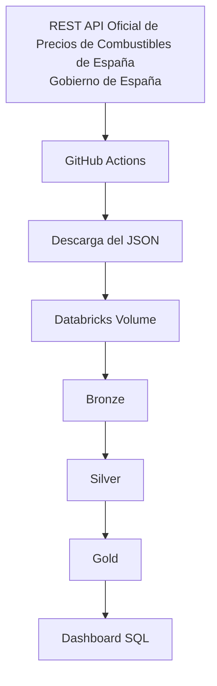
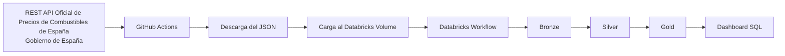
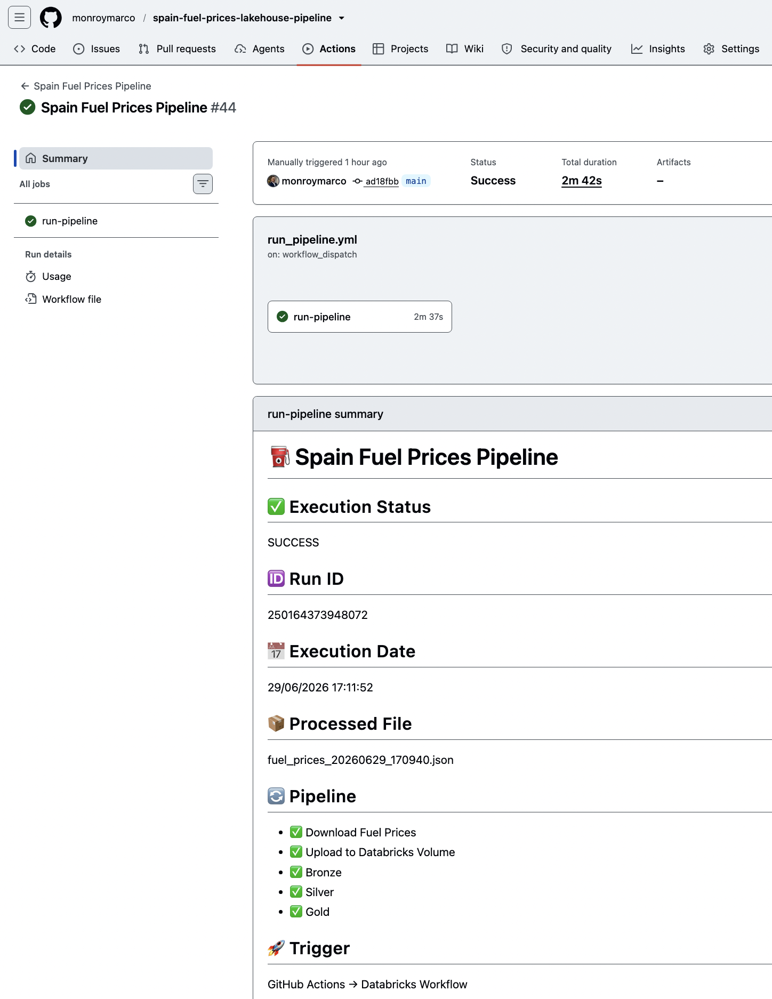
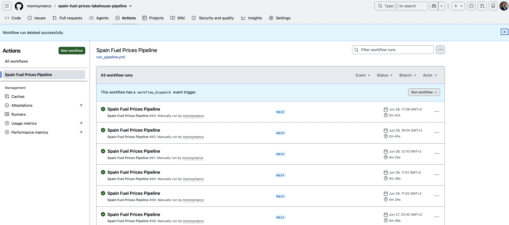
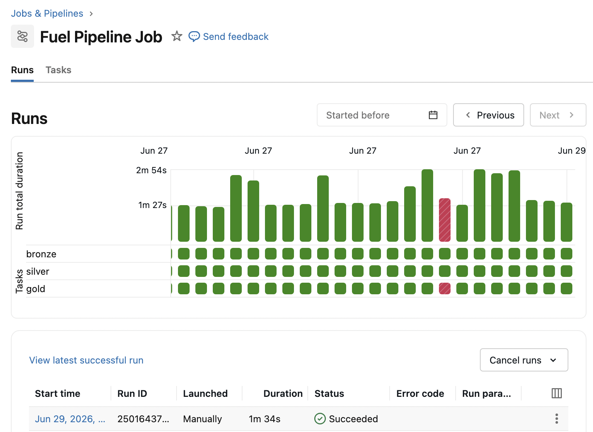

<p align="center">
🇪🇸 <strong>Español</strong> | 🇬🇧 <a href="README.md">English Version</a>
</p>

<p align="center">
  
</p>

<p align="center">
  
  
  
  
  
  
</p>

# ⛽ Spain Fuel Prices Automated Lakehouse Pipeline

> Pipeline Lakehouse automatizado para el análisis de precios de combustibles en España utilizando GitHub Actions, Databricks Workflows, PySpark y la Arquitectura Medallion.

---

## 📑 Índice

- [Descripción General del Proyecto](#1-descripción-general-del-proyecto)
- [Arquitectura](#2-arquitectura)
- [Tecnologías](#3-tecnologías)
- [Estructura del Proyecto](#4-estructura-del-proyecto)
- [Fuente de Datos](#5-fuente-de-datos)
- [Flujo del Pipeline](#6-flujo-del-pipeline)
- [Arquitectura Medallion](#7-arquitectura-medallion)
- [Capa Bronze](#8-capa-bronze)
- [Capa Silver](#9-capa-silver)
- [Capa Gold](#10-capa-gold)
- [Automatización](#11-automatización)
- [Dashboard](#12-dashboard)
- [KPIs](#13-kpis)
- [Cómo Ejecutar el Proyecto](#14-cómo-ejecutar-el-proyecto)
- [Resultados del Proyecto](#15-resultados-del-proyecto)
- [Mejoras Futuras](#16-mejoras-futuras)
- [Lecciones Aprendidas](#17-lecciones-aprendidas)

---

# 1. Descripción General del Proyecto

Este proyecto implementa un pipeline Lakehouse automatizado para el análisis de precios de combustibles en España utilizando la Arquitectura Medallion (Bronze, Silver y Gold) sobre Databricks.

El pipeline descarga automáticamente el conjunto de datos más reciente desde la REST API oficial de precios de combustibles del Gobierno de España, carga el archivo JSON sin procesar en un Databricks Volume, procesa la información mediante varias capas de transformación utilizando PySpark y genera conjuntos de datos analíticos que alimentan dashboards de inteligencia de negocio y análisis de precios.

Todo el flujo de trabajo está automatizado mediante GitHub Actions y Databricks Workflows. Un Self-hosted GitHub Actions Runner ejecuta el pipeline, permitiendo una ejecución completa de extremo a extremo con un solo clic.

El proyecto procesa información de más de **11.000 estaciones de servicio** distribuidas por toda España y genera conjuntos de datos analíticos como rankings nacionales, rankings provinciales, precios medios, variaciones históricas de precios y análisis comparativos entre estaciones.

Este proyecto demuestra habilidades prácticas en Ingeniería de Datos, incluyendo desarrollo de procesos ETL, modelado de datos, orquestación de workflows, Delta Lake, transformaciones con PySpark, análisis mediante Spark SQL y automatización de pipelines en la nube.

---

# 2. Arquitectura



---

# 3. Tecnologías

| Tecnología           | Propósito                                                                                                 |
| -------------------- | --------------------------------------------------------------------------------------------------------- |
| Python               | Descarga el conjunto de datos de precios de combustibles y ejecuta los scripts de automatización.         |
| PySpark              | Realiza transformaciones distribuidas de datos en las capas Bronze, Silver y Gold.                        |
| Databricks           | Plataforma utilizada para construir, ejecutar y orquestar el pipeline Lakehouse.                          |
| Delta Lake           | Proporciona almacenamiento confiable con transacciones ACID para todos los conjuntos de datos procesados. |
| GitHub Actions       | Automatiza la ejecución completa del pipeline de extremo a extremo.                                       |
| Self-hosted Runner   | Ejecuta los workflows de GitHub Actions en una máquina dedicada.                                          |
| Databricks Workflows | Orquesta la ejecución secuencial de los notebooks Bronze, Silver y Gold.                                  |
| Databricks Volumes   | Almacena los archivos JSON descargados desde la REST API.                                                 |
| Databricks SQL       | Permite realizar consultas analíticas y crear dashboards interactivos.                                    |
| SQL                  | Se utiliza para consultas analíticas y generación de KPIs.                                                |
| REST API             | Obtiene los precios oficiales de combustibles publicados por el Gobierno de España.                       |
| Git y GitHub         | Control de versiones y gestión del código fuente.                                                         |

---

# 4. Estructura del Proyecto

```text
spain-fuel-prices-lakehouse-pipeline/

│

├── .github/

│   ├── workflows/

│   │   └── run_pipeline.yml

│   └── scripts/

│       └── generate_summary.py

│

├── data/

│   └── raw/

│

├── notebooks/

│   ├── 01_bronze.py

│   ├── 02_silver.py

│   └── 03_gold.py

│

├── scripts/

│   ├── download_fuel_prices.py

│   └── upload_to_databricks.py

│

├── requirements.txt

├── .gitignore

└── README.md
```

### Descripción de Directorios

| Directorio          | Descripción                                                                                        |
| ------------------- | -------------------------------------------------------------------------------------------------- |
| `.github/workflows` | Workflow de GitHub Actions que automatiza la ejecución completa del pipeline.                      |
| `.github/scripts`   | Scripts auxiliares utilizados por GitHub Actions.                                                  |
| `data/raw`          | Almacenamiento temporal de los archivos JSON descargados antes de cargarlos en Databricks.         |
| `notebooks`         | Notebooks de Databricks que implementan las capas Bronze, Silver y Gold.                           |
| `scripts`           | Scripts en Python responsables de descargar el conjunto de datos y cargarlo en Databricks Volumes. |
| `README.md`         | Documentación del proyecto en inglés.                                                              |
| `README_ES.md`      | Documentación del proyecto en español.                                                             |
| `requirements.txt`  | Dependencias de Python necesarias para ejecutar el proyecto localmente.                            |
| `.gitignore`        | Archivos y directorios excluidos del control de versiones.                                         |

---

# 5. Fuente de Datos

El pipeline utiliza como fuente principal de información la **REST API Oficial de Precios de Combustibles de España (Gobierno de España)**.

La API proporciona precios actualizados de combustibles para estaciones de servicio de toda España, incluyendo la identificación de la estación, operador, dirección, coordenadas geográficas y precios de los distintos tipos de combustible.

### Información de la Fuente de Datos

- **Fuente:** REST API Oficial de Precios de Combustibles de España
- **Proveedor:** Gobierno de España
- **Formato:** JSON
- **Frecuencia de actualización:** Aproximadamente cada 30 minutos
- **Cobertura:** Más de 11.000 estaciones de servicio en toda España

El conjunto de datos se descarga automáticamente mediante GitHub Actions y posteriormente se carga en un Databricks Volume antes de ser procesado mediante la Arquitectura Medallion.

---

# 6. Flujo del Pipeline

El pipeline se ejecuta automáticamente desde la ingesta de datos hasta la generación de conjuntos de datos analíticos.



### Etapas del Pipeline

1. Descargar el conjunto de datos más reciente desde la REST API oficial.
2. Guardar el archivo JSON localmente.
3. Cargar el conjunto de datos en un Databricks Volume.
4. Ejecutar el Databricks Workflow.
5. Transformar los datos sin procesar en la capa Bronze.
6. Limpiar y estandarizar los datos en la capa Silver.
7. Generar KPIs de negocio en la capa Gold.
8. Consultar las tablas Gold mediante Databricks SQL.
9. Visualizar los resultados en el dashboard analítico.

---

# 7. Arquitectura Medallion

El proyecto sigue la **Arquitectura Medallion**, un patrón de diseño de datos multicapa ampliamente utilizado en plataformas Lakehouse modernas.

Cada capa tiene una responsabilidad específica:

| Capa      | Propósito                                                                                       |
| --------- | ----------------------------------------------------------------------------------------------- |
| 🥉 Bronze | Almacena los datos sin procesar exactamente como se reciben desde la REST API.                  |
| 🥈 Silver | Limpia, valida y estandariza los datos para su análisis.                                        |
| 🥇 Gold   | Genera conjuntos de datos listos para el negocio y KPIs optimizados para informes y dashboards. |

### Beneficios

- Refinamiento progresivo de los datos.
- Mayor calidad de los datos.
- Separación entre datos sin procesar y datos curados.
- Mejor escalabilidad y mantenibilidad.
- Mayor rendimiento para consultas analíticas.
- Simplificación de los procesos de reporting.

La Arquitectura Medallion permite transformar datos brutos de precios de combustibles en conjuntos de datos analíticos confiables, manteniendo la trazabilidad de la información durante todo el proceso.

---

# 8. Capa Bronze

La capa Bronze es responsable de ingerir el conjunto de datos sin procesar en el Lakehouse sin aplicar transformaciones de negocio.

### Objetivos

- Leer el archivo JSON desde el Databricks Volume.
- Preservar la información original obtenida desde la REST API.
- Agregar metadatos de ingesta.
- Almacenar el conjunto de datos como una tabla Delta.

### Principales Transformaciones

- Leer el conjunto de datos en formato JSON.
- Expandir la lista de estaciones de servicio.
- Extraer los campos requeridos.
- Agregar la fecha del conjunto de datos.
- Agregar la fecha y hora de ingesta.
- Guardar el resultado como la tabla Delta `bronze_fuel_prices`.

### Salida

**Tabla**

```text
bronze_fuel_prices
```

### Columnas Principales

- fecha_dataset
- fecha_ingestion
- id_estacion
- provincia
- municipio
- direccion
- rotulo
- latitud
- longitud
- precio_gasoleo_a
- precio_gasolina_95
- precio_gasolina_98

La capa Bronze conserva la estructura original de los datos y constituye la base para todas las transformaciones posteriores del pipeline.

---

# 9. Capa Silver

La capa Silver transforma los datos sin procesar de Bronze en un conjunto de datos limpio, estandarizado y preparado para análisis.

### Objetivos

- Limpiar valores inconsistentes.
- Estandarizar los tipos de datos.
- Normalizar el conjunto de datos.
- Mejorar la calidad de los datos.
- Preparar la información para el análisis de negocio.

### Principales Transformaciones

- Convertir latitud y longitud a valores numéricos.
- Convertir los precios de los combustibles al tipo `DOUBLE`.
- Gestionar valores inválidos utilizando `try_cast()`.
- Normalizar los separadores decimales.
- Eliminar registros con precios de combustible nulos.
- Transformar el conjunto de datos del formato **Wide** al formato **Long** utilizando la función `stack()`.
- Generar una única columna `fuel_type`.
- Generar una columna estandarizada `price`.

### Salida

**Tabla**

```text
silver_fuel_prices
```

### Columnas Principales

- fecha_dataset
- fecha_ingestion
- id_estacion
- provincia
- municipio
- direccion
- rotulo
- latitud
- longitud
- fuel_type
- price

### Beneficios

La capa Silver genera un conjunto de datos limpio y estandarizado que simplifica las consultas analíticas, permite trabajar con múltiples tipos de combustible mediante un modelo de datos unificado y sirve como base para todos los KPIs de negocio generados en la capa Gold.

---

# 10. Capa Gold

La capa Gold contiene conjuntos de datos listos para el negocio, optimizados para generación de informes, dashboards y consultas analíticas.

Esta capa transforma los datos depurados de la capa Silver en KPIs de negocio mediante agregaciones, funciones de ranking y comparaciones históricas de precios.

### Objetivos

- Generar KPIs de negocio.
- Crear tablas analíticas.
- Dar soporte a la visualización de dashboards.
- Facilitar la comparación de precios de combustibles en toda España.
- Identificar tendencias de precios y oportunidades competitivas.

### Principales Transformaciones

- Calcular el precio medio nacional de los combustibles.
- Calcular el precio medio por provincia.
- Generar rankings nacionales de precios.
- Generar rankings provinciales de precios.
- Identificar las estaciones de servicio más económicas.
- Identificar las estaciones de servicio más caras.
- Comparar los precios de las estaciones con la media provincial.
- Calcular variaciones históricas de precios entre snapshots.
- Crear conjuntos de datos optimizados para dashboards de Databricks SQL.

### Principales Tablas Gold

- `gold_fuel_avg_price_by_province`
- `gold_fuel_avg_price_national`
- `gold_fuel_cheapest_station_by_province`
- `gold_fuel_cheapest_ranking_nacional_top_10`
- `gold_fuel_expensive_ranking_nacional_top_10`
- `gold_fuel_price_change_vs_previous_snapshot`
- `gold_fuel_price_vs_provincial_average`
- `gold_fuel_top_price_decreases`
- `gold_fuel_top_price_increases`

### Características Analíticas

- Funciones Window
- Rankings
- Agregaciones
- Comparaciones Históricas
- Tablas Delta
- KPIs de Negocio

La capa Gold proporciona conjuntos de datos analíticos optimizados que permiten identificar tendencias en los precios de los combustibles, comparar precios entre provincias, monitorizar cambios históricos y apoyar la toma de decisiones mediante dashboards interactivos.

---

# 11. Automatización

Todo el pipeline está completamente automatizado utilizando GitHub Actions, un Self-hosted GitHub Actions Runner y Databricks Workflows.

El proceso de automatización ejecuta el pipeline completo de extremo a extremo con un solo clic, desde la descarga del conjunto de datos más reciente hasta la generación de las tablas analíticas de la capa Gold.

### Flujo de Automatización

GitHub Actions → Self-hosted Runner → Descarga de Precios de Combustibles → Carga del JSON → Databricks Workflow → Bronze → Silver → Gold → Resumen de Ejecución

### Workflow de GitHub Actions



### Ejecución Correcta de GitHub Actions



### Databricks Workflow



---

# 12. Dashboard

El proyecto incluye un Dashboard interactivo de Databricks SQL construido sobre las tablas de la capa Gold.

El dashboard ofrece una visión orientada al negocio de los precios de los combustibles en España, permitiendo monitorizar tendencias, comparar provincias e identificar las estaciones de servicio más competitivas.

### Funcionalidades del Dashboard

- Rankings nacionales de precios de combustibles.
- Rankings provinciales de precios.
- Precio medio de los combustibles por provincia.
- Estaciones de servicio más económicas.
- Estaciones de servicio más caras.
- Variaciones de precios entre snapshots.
- Comparación de precios respecto a la media provincial.
- Filtros interactivos por tipo de combustible.

### Beneficios del Dashboard

El dashboard transforma datos brutos de precios de combustibles en información útil para el negocio, permitiendo identificar patrones de precios, comparar mercados regionales y apoyar la toma de decisiones basada en datos.

## Dashboard Ejecutivo


## Rankings Nacionales de Combustibles


## Análisis Provincial


---

# 13. KPIs

La capa Gold genera múltiples conjuntos de datos listos para el negocio, diseñados para informes analíticos y visualización en dashboards.

| KPI                                 | Descripción                                                      |
| ----------------------------------- | ---------------------------------------------------------------- |
| Ranking Nacional de Precios         | Identifica las estaciones de servicio más económicas de España.  |
| Ranking Provincial de Precios       | Clasifica las estaciones de servicio dentro de cada provincia.   |
| Precio Medio por Provincia          | Calcula el precio medio del combustible en cada provincia.       |
| Estaciones Más Económicas           | Identifica las estaciones con los precios más bajos.             |
| Estaciones Más Caras                | Identifica las estaciones con los precios más altos.             |
| Comparación con la Media Provincial | Compara el precio de cada estación con la media de su provincia. |
| Variaciones Históricas de Precios   | Registra los cambios de precio entre snapshots consecutivos.     |
| Mayores Bajadas de Precio           | Identifica las estaciones con las mayores reducciones de precio. |
| Mayores Subidas de Precio           | Identifica las estaciones con los mayores incrementos de precio. |

Estos KPIs permiten realizar un análisis integral de los precios de los combustibles en España y proporcionan información valiosa tanto para consumidores como para analistas de negocio.

---

# 14. Cómo Ejecutar el Proyecto

### Requisitos Previos

Antes de ejecutar el proyecto, asegúrate de cumplir con los siguientes requisitos:

- Python 3.11+
- Git
- Workspace de Databricks
- Databricks SQL Warehouse
- Cuenta de GitHub
- GitHub Actions
- Self-hosted GitHub Actions Runner

### Clonar el Repositorio

```bash
git clone https://github.com/monroymarco/spain-fuel-prices-lakehouse-pipeline.git

cd spain-fuel-prices-lakehouse-pipeline
```

### Instalar las Dependencias

```bash
pip install -r requirements.txt
```

### Configurar los GitHub Secrets

Configura los siguientes secretos en el repositorio de GitHub:

- DATABRICKS_HOST
- DATABRICKS_TOKEN
- DATABRICKS_JOB_ID
- DATABRICKS_WAREHOUSE_ID

## Iniciar el Self-hosted Runner

Antes de ejecutar el pipeline, asegúrate de que el Self-hosted GitHub Actions Runner esté en funcionamiento y conectado al repositorio.

## Ejecutar el Pipeline

El pipeline puede iniciarse manualmente desde la pestaña **GitHub Actions** del repositorio.

El workflow realiza automáticamente los siguientes pasos:

1. Descarga el conjunto de datos más reciente desde la REST API Oficial de Precios de Combustibles de España.
2. Guarda el archivo JSON localmente.
3. Carga el conjunto de datos en Databricks Volumes.
4. Ejecuta el Databricks Workflow.
5. Ejecuta el notebook Bronze.
6. Ejecuta el notebook Silver.
7. Ejecuta el notebook Gold.
8. Genera el resumen de ejecución de GitHub Actions.

## Verificar los Resultados

Después de una ejecución satisfactoria:

- Las tablas Delta Bronze, Silver y Gold se actualizan.
- El Dashboard de Databricks SQL refleja el último snapshot procesado.
- El histórico de precios de los combustibles se conserva para el análisis de tendencias.
- La ejecución del workflow puede verificarse tanto en GitHub Actions como en Databricks Workflows.

---

# 15. Resultados del Proyecto

El proyecto implementa con éxito un pipeline Lakehouse totalmente automatizado para el análisis de precios de combustibles en España.

### Resultados Principales

- Pipeline ETL automatizado de extremo a extremo.
- Integración con la REST API Oficial de Precios de Combustibles de España.
- Procesamiento de datos de más de **11.000 estaciones de servicio en cada ejecución**.
- Implementación de la Arquitectura Medallion (Bronze, Silver y Gold).
- Ejecución automatizada mediante GitHub Actions.
- Orquestación mediante Databricks Workflows.
- Almacenamiento confiable utilizando tablas Delta Lake.
- Dashboard interactivo en Databricks SQL para análisis de negocio.
- Comparación histórica de precios entre snapshots.
- Conjuntos de datos analíticos a nivel nacional y provincial.

### Logros Técnicos

- Integración con REST API
- Ingesta Automatizada de Datos
- Procesamiento Distribuido con PySpark
- Implementación de Delta Lake
- Modelado de Datos
- Funciones Window
- Análisis con Spark SQL
- Automatización con GitHub Actions
- Self-hosted GitHub Actions Runner
- Orquestación con Databricks Workflows

El proyecto demuestra el ciclo de vida completo de una solución moderna de Ingeniería de Datos, desde la ingesta de información hasta la generación de conjuntos de datos analíticos listos para el negocio.

---

# 16. Mejoras Futuras

Se pueden implementar diversas mejoras para ampliar las capacidades del pipeline:

- Programar ejecuciones automáticas mediante Databricks Jobs o GitHub Actions.
- Implementar controles de calidad de datos mediante reglas de validación.
- Incorporar monitoreo y alertas para detectar fallos en el pipeline.
- Integrar Unity Catalog para una gobernanza centralizada de los datos.
- Dar soporte a tipos adicionales de combustible.
- Desarrollar modelos predictivos para estimar precios futuros de los combustibles.
- Exponer los conjuntos de datos analíticos mediante APIs REST.
- Contenerizar el pipeline utilizando Docker.
- Implementar estrategias de despliegue CI/CD.
- Optimizar las transformaciones de Spark para conjuntos de datos de mayor tamaño.
- Desplegar la solución sobre Azure Databricks.

Estas mejoras incrementarían la escalabilidad, mantenibilidad y preparación para entornos de producción, siguiendo las mejores prácticas modernas de Ingeniería de Datos.

---

# 17. Lecciones Aprendidas

El desarrollo de este proyecto proporcionó experiencia práctica en tecnologías modernas de Ingeniería de Datos, plataformas Lakehouse en la nube y automatización de pipelines de datos de extremo a extremo.

### Habilidades Técnicas Adquiridas

- Integración con REST APIs.
- Automatización con Python.
- Transformaciones con PySpark.
- Spark SQL.
- Delta Lake.
- Arquitectura Medallion.
- Databricks Workflows.
- GitHub Actions.
- Self-hosted GitHub Actions Runner.
- Modelado de Datos.
- Funciones Window.
- Procesamiento Histórico de Datos.
- Desarrollo de Dashboards con Databricks SQL.
- Diseño de Pipelines ETL de Extremo a Extremo.
- Control de Versiones con Git.

### Principales Aprendizajes

- Diseñar arquitecturas Lakehouse escalables.
- Construir pipelines automatizados para la ingesta de datos.
- Transformar datos sin procesar en conjuntos de datos listos para el negocio.
- Gestionar información histórica de forma eficiente.
- Validar resultados analíticos frente a fuentes oficiales.
- Aplicar buenas prácticas de Ingeniería de Software en proyectos de Ingeniería de Datos.
- Desarrollar workflows con enfoque de producción utilizando Databricks y GitHub.

## Este proyecto demuestra el ciclo de vida completo de una solución moderna de Ingeniería de Datos, combinando ingesta automatizada de datos, procesamiento distribuido con PySpark, Delta Lake, orquestación de workflows y analítica de negocio mediante Databricks.
